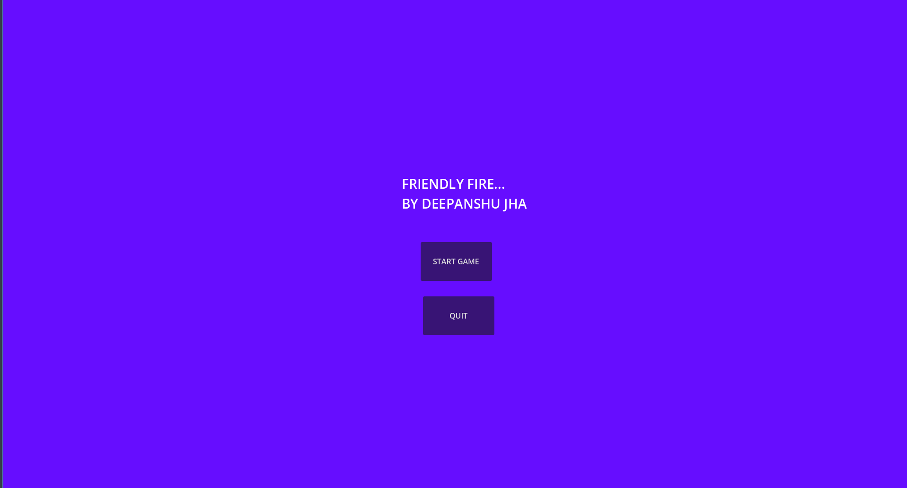
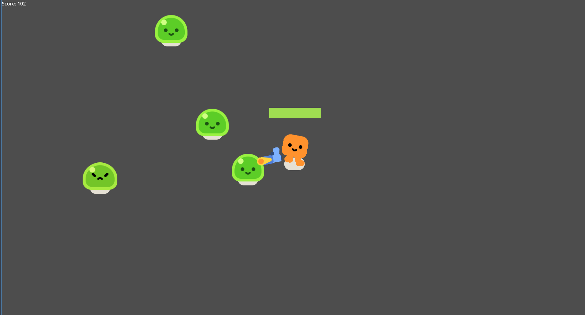

# **Friendly Fire**

**Genre:** 2D Survival Action Game
**Engine:** Godot 4.x

---

## **Game Overview**

**Friendly Fire** is a 2D survival action game where the player controls **Happy Boo**, a cheerful character facing a tragic dilemma. Happy Boo’s village was peaceful until a mysterious infection turned all his friends into **slimes** — once loved companions, now hostile enemies.

To survive, Happy Boo must make **painful sacrifices** and defeat the slimes, navigating through waves of enemies while managing health and survival score. The game tests both reflexes and strategy as the player struggles to survive against former friends.

---

## **Story**

Happy Boo lived happily with friends in a peaceful village. One fateful day, a dark infection spread, turning all the friends into aggressive slimes.

Now, Happy Boo faces a heart-wrenching choice: **fight the slimes — once friends — to survive**. Each wave becomes more challenging as the infection grows, forcing Happy Boo to sacrifice what he once cherished to stay alive.

---

## **Gameplay Features**

* **Dynamic Enemy Spawning:** Slimes chase Happy Boo with increasing speed and frequency.
* **Health System:** Avoid taking too much damage from slimes or risk game over.
* **Score System:** Your survival time is recorded as a score.
* **Game Over Screen:** Shows final score and allows restarting the game.
* **Lobby & Story Scene:** Introduces the story before gameplay begins.

---

## **Controls**

* **Move:** Arrow Keys or WASD
* **Attack / Shoot:** Spacebar (or implemented key)
* **Start Game / Quit:** Use the Lobby buttons
* **Skip Story Scene:** Press Enter / Click Continue

---

## **AI Features (Game Mechanics)**

* **Mob Movement AI:** Slimes chase the player intelligently using simple pathfinding logic.
* **Adaptive Difficulty:** Enemy spawn rate and speed increase as the player survives longer.
* **Collision & Damage Detection:** Slimes detect and respond to player proximity.

---

## **How to Play**

1. Open the project in **Godot Engine (v4.x recommended)**.
2. Press **F5 (Play Project)** — the game will start at the **Lobby**.
3. Click **Start Game** to begin the story scene.
4. Watch the story unfold, then control Happy Boo to survive the slimes.
5. Avoid damage, defeat enemies, and maximize your score.

---

## **Future Enhancements (Optional)**

* Predictive mob AI that anticipates player movement.
* Procedural story sequences depending on player choices.
* Additional power-ups or abilities for Happy Boo.

---

## **Acknowledgements**

* Godot Engine 4.x
* Free assets for sprites, sounds, and backgrounds
* AI used for debugging and logic development in game.gd file for restart and score function

---

If you want, I can also **make a version with a short “submission-ready” format with screenshots** for a school or competition submission so it looks more professional and compact.

Do you want me to do that?
